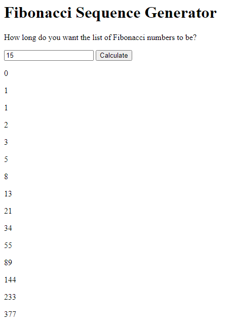

# Fibonacci Sequence Generator 📜

## Background

This repo is a simple Fibonacci sequence calculator. It takes an integer and calculates the Fibonacci sequence up to that many numbers.

---

## Introduction

The [Fibonacci sequence](https://en.wikipedia.org/wiki/Fibonacci_number#Sequence_properties) is a sequence of integers, starting with 0 and 1, in which each number is the sum of the previous two numbers.

The first ten Fibonacci numbers are...

0  (given)  
1  (given)  
1   (0 + 1)  
2   (1 + 1)  
3   (1 + 2)  
5   (2 + 3)  
8   (3 + 5)  
13  (5 + 8)  
21  (8 + 13)  
34  (13 + 21)  

A common technical interview problem is the production of an algorithm that can generate the Fibonacci sequence to a given number of figures. This repo solves that problem using modular JavaScript. It also includes an unstyled HTML UI that allows the user to input a Fibonacci sequence length and view the resulting values.

---

## Motivation

I undertook this project to practice some key skills:

- Common technical test problems (*The Fibonacci sequence*)
- DOM manipulation using vanilla JS
- Repo creation

---

## Screenshot

---

## Installation

This repo can be run locally in a browser.

1. [Clone this repo](https://github.com/DevArrowsmith/fibonacci).
2. Open index.html in a web browser.

---

## Framework

Built with [HTML](https://developer.mozilla.org/en-US/docs/Web/HTML) and [JavaScript](https://developer.mozilla.org/en-US/docs/Web/JavaScript).

---

## Future Work

1. Only allow positive integers to be entered into the input field.
2. Only display zero or one Fibonacci number when 0 or 1 is entered into the input field.  
(*Currently the numbers 0 and 1 are always shown*)
2. Display the index of each Fibonacci number, perhaps using a simple chart.
3. Style the application.
4. Add responsive styling.

